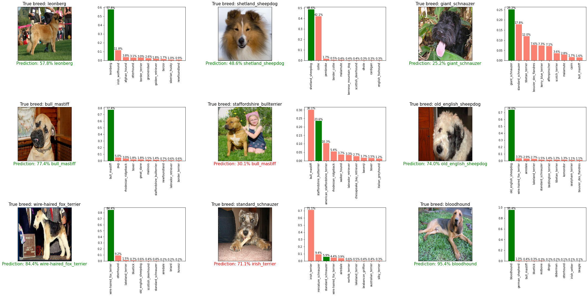

# Identifying the breed of a dog, using TensorFlow 2.x, Transfer learning (TensorFlow Hub)

Identifying the breeds of different dogs by just looking at their images, using deep learning & transfer learning concepts.  
This is a single notebook project which demonstrates some foundational deep learning and transfer learning concepts by exploring the problem of dog breed identification.  

## Environment requirments

This project is a single notebook(.ipynb file) in Python3, created using [Google Colab](https://research.google.com/colaboratory/).  
Here I used a pretrained model from [TensorFlow Hub](https://tfhub.dev/) which requires TensorFlow 2 and TensorFlow Hub 0.5.0 or newer.  
The tools and frameworks I used in this notebook are,  
  

## Problem statement

**Supervised Learning - Multi-class Classification Problem:** Identifying the breeds of different dogs by feeding the given images of them to a deep learning model.  

## Data for the problem

The data is downloaded from the [Kaggle Dog Breed Identification Competition](https://www.kaggle.com/c/dog-breed-identification/data).  
We are provided with a training set and a test set of **images of dogs**. Each image has a filename that is its unique `id`.  
The dataset comprises **120 breeds of dogs**, hence we have `120` different classes to identify.  
- In the **Train dataset**, there are around `10,200+` images of dogs with labels.
- In the **Test dataset**, there are around `10,300+` images of dogs without labels.
- There is also a `labels.csv` file with training images' `id`s and their respective `breeds`(labels).  

Here all the provided data images are in the uniform file extension `.jpg`  
You can look at the data and other files used & created in this notebook via this [Google Drive link](https://drive.google.com/drive/folders/1VWgKVTwmP7-Qcp9wYZ_dNdLDF2m-Qcy9?usp=sharing).  

## Data preprocessing

First, I loaded the `labels.csv` into a DataFrame and visualized the counts of training images for each breed.  
  

Since each class had fair amount of images to represent it, I moved to the data preproceesing.  
To prepare the data to feed it to the chosen deep learning model, first, I had to convert the input data into the form numbers, in this case convert it into tensors.  

To maintain the [Kaggle submission file requirement](https://www.kaggle.com/c/dog-breed-identification/overview/evaluation) I converted the labels of each image into a array of `120` boolean labels(True for actual breed; False for other breeds).   

I also extracted the filepaths of images in the training data with their `id` and the file extension `.jpg`,appended them to a list.  
I splitted only the `1000` images from the whole dataset as trial data to train & validate the baseline model. `X`= 800 images for train data, `y`= 200 images for validation data.  

As the images paths(X) and labels(y) were ready, I created functions to get the images from filepaths, convert them into tensors(numbers(float)) with 3 color channels and shape them into uniform size of `(224 X 224)` and to create TensorFlow BatchDatasets of preferred batch size `32` from the processed images and their respective breeds(boolean labels).  

After that I visualized the batches to look at the images of dogs. Here the sample of it,  


# Model building

I used the **Transfer learning** method, where a model developed for a particular task is reused as the starting point for a model on a different but similar kind of task, to build a model for this problem.  
The pretrained model from [TensorFlow Hub](https://tfhub.dev/) used here is `Mobilenet_v2_130_224`. This is a SavedModel in TensorFlow 2 format.  

**Details about the model:**  
Imagenet (ILSVRC-2012-CLS) classification with MobileNet V2 (depth multiplier 1.30), with an input image size of `224x224` pixels.  
You can find more about this model from the official [TensorFlow Hub model's documentation page](https://tfhub.dev/google/imagenet/mobilenet_v2_130_224/classification/5).  

**Usage:**  
This model can be used with the `hub.KerasLayer` as follows,  
```Python
model = tf.keras.Sequential([
    hub.KerasLayer("https://tfhub.dev/google/imagenet/mobilenet_v2_130_224/classification/5")
])
model.build([None, 224, 224, 3])  # Batch input shape.
```  

**Credits:**  
MobileNet V2 is a family of neural network architectures for efficient on-device image classification and related tasks, originally published by  
>*Mark Sandler, Andrew Howard, Menglong Zhu, Andrey Zhmoginov, Liang-Chieh Chen: "Inverted Residuals and Linear Bottlenecks: Mobile Networks for Classification, Detection and Segmentation", 2018.*  

Then, I created functions to instantiate the model using **TensorFlow Keras Sequential API** with 2 layers(input & output layers) and compiled it with `Adam` optimizer.  
I also created a small function to create the `TensorBoard` callback for the model to track its performance along with a `EarlyStopping` callback to prevent model training for long time without improvement or restrict from overfitting.  

After all tihs steps I fitted the first model with the subset of `1000` images. Then I loaded the `TensorBoard` into the notebook to track the model.  
  

## Predictions and their visualization

I made predictions with the `validation data` as I splitted `200` images with their labels for evaluating the model.  
Predicting and viewing the predictions probabilities/confidence scores as numbers was not exactly exciting, but making them more visual gave real evaluation.  
Plotting them and viewing the model's performance was a real fun. Look at those plots here,  
  

## Model training with complete data

Since the preprocesing and all other functions worked well with small portion (1000 images) of data, I trained the model with complete dataset of `10,000+` images of test data.  
Traning a model on `10,000+` images took fairly long time. So, I saved the trained model. So taht I can use it, instead of training it again, in case of any connection loss or memory error that erases the trained model  

## Test data into the notebook & Kaggle Submission

Kaggle wants us to submit the prediction results of test data on the competition page.  
Eventhough the competition ended, I decided to give a late submission. For that I processed the test data and converted it into TensorFlow BatchDataset and made predictions on the model trained with complete training dataset.  

Finally, I created a `.csv` file with the prediction probabilities of the images in the format asked by Kaggle and submitted it and I got multi class log loss score of **`1.03412`** (and **`0.98266`** on second try).  
  

## Further proceedings

***Apart from the things which were tried in this project, there are so many methods and ways to explore a structured dataset and extract insights from it.***  

This notebook is just an example of Multi-class image classification problem.  
Other than the concepts explored in this notebook, there are plenty of ways to create & improve a deep learing model.  
Some example things we can do to get more from the data,  
- Trying another model from TensorFlow Hub - maybe a different model would perform better on the dataset.
- Manipulating the training data to be more robest train dataset would help improving the model performance.
- Can fine tune the pretrained model's knowledge to use it more wisely with this dataset  

There are number of ways to create, train, evaluate and improve a model. The machine learning/deep learning model creation, training and development are always an iterative experimentation process. Every problem and question have their own different kind of solutions. Approaching different problems in their own ways within the given situation and statements is important.  
Starting with understanding the problem statement, which question is to be answered, why and how to solve are paramount in a ML/DL projects.  

---

Thanks for viewing this project and my [Github Profile](https://github.com/kdineshchitra).  
Please provide your thoughts and insights to this little project.  
Always ready to collaborate, learn and grow with others. See you in my next project.
